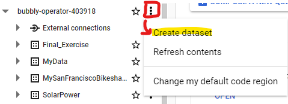

# European Soccer Analysis in SQL

The **European Soccer Database** is collection of four individual CSV files:

- leagues.csv
- match.csv
- player.csv
- team.csv

### Data Analysis with SQL

1. Create a new data set called “**Final_Excercise**” in **Google BigQuery** and load each csv file as a separate table.




2. Create a schema that represents the relationship between all the tables:
    1. For each table, PK/FK were identified.
    2. For each table, its shape is provided near the table name.
    3. When possible, the tables are linked to each other through their keys.

](European%20Soccer%20Analysis%20in%20SQL%20a48f44195c794eb9ab70c0cc524412f4/Untitled%205.png)

Entity Relationship Diagram made with Lucidchart, available [**here**](https://lucid.app/lucidchart/b7e16210-0654-4128-88e0-85e4b0c72f5b/edit?shared=true&page=0_0&invitationId=inv_4312c9d1-960b-4ed8-847f-aa275ec33ae7#)

3. How many days have passed from the oldest **Match** to the most recent one (dataset time interval)?

```sql
-- How many days have passed from the oldest Match to the most recent one (dataset time interval)?

SELECT
--MIN(date) AS DateOldestMatch,
--MAX(date) AS DateNewestMatch,
TIMESTAMP_DIFF(MAX(date), MIN(date), DAY) AS NumDaysOldNewMatch
FROM
  `bubbly-operator-403918.Final_Exercise.imdb_match`
```

### Defensive solution:

```sql
-- How many days have passed from the oldest Match to the most recent one (dataset time interval)?

SELECT
--date,
--MIN(date) AS DateOldestMatch,
--MAX(date) AS DateNewestMatch,

-- DATE_DIFF is more defensive with respect to TIMESTAMP_DIFF since this last returns one day of difference if at least 24 hours have passed, but in this case we are not interested in the hour, it is sufficient the change of day number to consider 1 day difference. 02/01/2023 - 01/01/2023 = 1 day (DATE_DIFF); 02/01/2023 23:00:00 - 01/01/2023 07:00:00 = 0 day (TIMESTAMP_DIFF)

DATE_DIFF(MAX(EXTRACT (DATE FROM date)), MIN(EXTRACT (DATE FROM date)), DAY) AS NumDaysOldNewMatch 
--EXTRACT (DATE FROM date) AS DateOnly
FROM
  `bubbly-operator-403918.Final_Exercise.imdb_match`
```


4. Produce a table which, for each Season and **League** Name, shows the following statistics about the home goals scored:
    1. min
    2. average
    3. mid-range
    4. max
    5. sum

```sql
-- Produce a table which, for each Season and League Name, shows the following statistics about the home goals scored: min, average, mid-range, max, sum.
-- Which combination of Season-League has the highest number of goals?

SELECT Match.season,
League.name AS LeagueName,
MIN(Match.home_team_goal) AS MinHomeGoals,
ROUND(AVG(Match.home_team_goal),1) AS AvgHomeGoals,
-- Mid-range = AVG(max,min) = (max + min)/2
ROUND((MAX(Match.home_team_goal) + MIN(Match.home_team_goal))/2,1) AS MidRangeHomeGoals,
MAX(Match.home_team_goal) AS MaxHomeGoals,
SUM(Match.home_team_goal) AS TotHomeGoals
FROM
  `bubbly-operator-403918.Final_Exercise.imdb_match` AS Match
LEFT JOIN `bubbly-operator-403918.Final_Exercise.imdb_leagues` AS League
ON Match.league_id = League.id
GROUP BY Match.season, League.name
ORDER BY TotHomeGoals DESC
LIMIT 1
```


5. Find out how many unique seasons there are in the **Match** table.
Then write a query that shows, for each Season, the number of matches played by each League. Do you notice anything out of the ordinary?

> **In the Match table there are 8 unique seasons**

```sql
-- Write a query that shows, for each Season, the number of matches played by each League

SELECT Match.season,
League.name AS LeagueName,
--MIN(Match.home_team_goal) AS MinHomeGoals,
--ROUND(AVG(Match.home_team_goal),1) AS AvgHomeGoals,
-- Mid-range = AVG(max,min) = (max + min)/2
--ROUND((MAX(Match.home_team_goal) + MIN(Match.home_team_goal))/2,1) AS MidRangeHomeGoals,
--MAX(Match.home_team_goal) AS MaxHomeGoals,
--SUM(Match.home_team_goal) AS TotHomeGoals
COUNT(Match.id) AS TotMatchesPlayed
FROM
  `bubbly-operator-403918.Final_Exercise.imdb_match` AS Match
LEFT JOIN `bubbly-operator-403918.Final_Exercise.imdb_leagues` AS League
ON Match.league_id = League.id
GROUP BY Match.season, League.name
ORDER BY Match.season, TotMatchesPlayed DESC
```


> We can notice that, in **season 2013/2014**, the **Belgium Jupiler League** played **only 12 matches** (it was used to play around 240 matches per season)

6. Using Players as the starting point, **create a new table** (PlayerBMI) and add:
    1. a new variable that represents the players’ weight in kg (divide the mass value by 2.205) and call it kg_weight;
    2. a variable that represents the height in metres (divide the cm value by 100) and call it m_height;
    3. a variable that shows the body mass index (BMI) of the player;
    4. Filter the table to show only the players with an optimal BMI (from 18.5 to 24.9).

How many rows does this table have?

> **The PlayerBMI table has 10197 rows**

```sql
-- Starting from Player table, create a new table "PlayerBMI" and add kg_weight (the dataset is in lbs), m_height (the dataset is in cm), BMI

CREATE TABLE Final_Exercise.PlayerBMI AS

WITH tbPlayer AS (
SELECT *,
weight/2.205 AS kg_weight, -- If I round, then the filter on BMI selects more players in the optimal range
height/100 AS m_height
FROM
  `bubbly-operator-403918.Final_Exercise.imdb_player`
),

PlayerBMI AS (
SELECT *,
-- BMI = kg/m^2
(kg_weight)/(POW(m_height,2)) AS BMI
FROM tbPlayer
)

SELECT *
FROM PlayerBMI
```


```sql
-- Filter the new table to show only the players with an optimal BMI (from 18.5 to 24.9)

SELECT *
FROM `bubbly-operator-403918.Final_Exercise.PlayerBMI`
WHERE ((BMI >= 18.5) AND (BMI <= 24.9))
```


7. How many players do not have an optimal BMI?

> **863 players do not have an optimal BMI**

```sql
-- How many players do not have an optimal BMI?

SELECT

(COUNT(CASE WHEN NOT((BMI >= 18.5) AND (BMI <= 24.9)) THEN 1 ELSE NULL
END)) AS TotPlayersWithUnoptimalBMI
FROM `bubbly-operator-403918.Final_Exercise.PlayerBMI`
```


8. Which **Team** has scored the highest total number of goals (home + away) during the most recent available season? How many goals has it scored?

> Check on PK/FK JOIN between Team and Match tables. **TbTeam has 299 rows**
> 

```sql
-- Match between tbMatch.away_team_api_id and tbTeam.team_api_id
-- All the rows of tbTeam match with the values listed within tbMatch.away_team_api_id
-- Instead, there is only 1 match between tbMatch.away_team_api_id and tbTeam.id

SELECT
DISTINCT Match.away_team_api_id,
--DISTINCT Match.home_team_api_id,
--Match.away_team_api_id,
Team.id AS TeamID,
Team.team_api_id
FROM
  `bubbly-operator-403918.Final_Exercise.imdb_match` AS Match
INNER JOIN `bubbly-operator-403918.Final_Exercise.imdb_team` AS Team
ON (Match.away_team_api_id = Team.team_api_id) --AND (Match.away_team_api_id = Team.team_api_id)
--ORDER BY Match.home_team_api_id
```


```sql
-- Match between tbMatch.home_team_api_id and tbTeam.team_api_id
-- All the rows of tbTeam match with the values listed within tbMatch.home_team_api_id
-- Instead, there is only 1 match between tbMatch.home_team_api_id and tbTeam.id

SELECT
DISTINCT Match.home_team_api_id,
--DISTINCT Match.home_team_api_id,
--Match.away_team_api_id,
Team.id AS TeamID
FROM
  `bubbly-operator-403918.Final_Exercise.imdb_match` AS Match
INNER JOIN `bubbly-operator-403918.Final_Exercise.imdb_team` AS Team
ON (Match.home_team_api_id = Team.team_api_id) --AND (Match.away_team_api_id = Team.team_api_id)
--ORDER BY Match.home_team_api_id
```


```sql
-- Match between tbMatch.away_team_api_id and tbTeam.id
-- All the rows of tbTeam match with the values listed within tbMatch.away_team_api_id
-- Instead, there is only 1 match between tbMatch.away_team_api_id and tbTeam.id

SELECT
DISTINCT Match.away_team_api_id,
--DISTINCT Match.home_team_api_id,
--Match.away_team_api_id,
Team.id AS TeamID,
Team.team_api_id
FROM
  `bubbly-operator-403918.Final_Exercise.imdb_match` AS Match
INNER JOIN `bubbly-operator-403918.Final_Exercise.imdb_team` AS Team
ON (Match.away_team_api_id = Team.id) --AND (Match.away_team_api_id = Team.team_api_id)
--ORDER BY Match.home_team_api_id
```


```sql
-- HOME
-- Which Team has scored the highest total number of goals (home + away) during the most recent available season? How many goals has it scored?

SELECT Match.home_team_goal,
Match.away_team_goal,
Match.season,
Team.team_long_name
FROM
  `bubbly-operator-403918.Final_Exercise.imdb_match` AS Match
LEFT JOIN `bubbly-operator-403918.Final_Exercise.imdb_team` AS Team
ON (Match.home_team_api_id = Team.team_api_id)
```


```sql
-- AWAY
-- Which Team has scored the highest total number of goals (home + away) during the most recent available season? How many goals has it scored?

SELECT Match.home_team_goal,
Match.away_team_goal,
Match.season,
Team.team_long_name
FROM
  `bubbly-operator-403918.Final_Exercise.imdb_match` AS Match
LEFT JOIN `bubbly-operator-403918.Final_Exercise.imdb_team` AS Team
ON (Match.away_team_api_id = Team.team_api_id)
```


### ⬇️ Solution ⬇️

```sql
-- Which Team has scored the highest total number of goals (home + away) during the most recent available season? How many goals has it scored?

WITH tbHomeVsAway AS (
SELECT season,
TeamHome.team_long_name AS TeamHomeName,
TeamAway.team_long_name AS TeamAwayName,
Match.home_team_goal,
Match.away_team_goal
FROM  `bubbly-operator-403918.Final_Exercise.imdb_match` AS Match
LEFT JOIN `bubbly-operator-403918.Final_Exercise.imdb_team` AS TeamHome
ON Match.home_team_api_id = TeamHome.team_api_id
LEFT JOIN `bubbly-operator-403918.Final_Exercise.imdb_team` AS TeamAway
ON Match.away_team_api_id = TeamAway.team_api_id
ORDER BY Match.season DESC
),

tbHomeGoals AS (
SELECT
season,
TeamHomeName,
SUM(home_team_goal) AS TotHomeGoals
FROM tbHomeVsAway
GROUP BY season, TeamHomeName
ORDER BY season DESC, TotHomeGoals DESC
),

tbAwayGoals AS (
SELECT
season,
TeamAwayName,
SUM(away_team_goal) AS TotAwayGoals
FROM tbHomeVsAway
GROUP BY season, TeamAwayName
ORDER BY season DESC, TotAwayGoals DESC
)

SELECT tbHomeGoals.season,
TeamHomeName AS TeamName,
--CAST(AVG(TotHomeGoals) AS INT) AS TotHomeGoals,
--TeamAwayName,
--CAST(AVG(TotAwayGoals) AS INT) AS TotAwayGoals,
(CAST(AVG(TotHomeGoals) AS INT)) + (CAST(AVG(TotAwayGoals) AS INT)) AS TotGoals
FROM tbHomeGoals
LEFT JOIN tbAwayGoals
ON (tbHomeGoals.TeamHomeName = tbAwayGoals.TeamAwayName) AND (tbHomeGoals.season = tbAwayGoals.season)
GROUP BY tbHomeGoals.season, tbHomeGoals.TeamHomeName
ORDER BY tbHomeGoals.season DESC, TotGoals DESC
```


> Season: **2015/2016**, Team: **FC Barcelona**, TotGoals: **112**

9. Create a query that, for each season, shows the name of the team that ranks first in terms of total goals scored (the output table should have as many rows as the number of seasons).
Which team was the one that ranked first in most of the seasons?

```sql
-- Create a query that, for each season, shows the name of the team that ranks first in terms of total goals scored (the output table should have as many rows as the number of seasons).
-- Which team was the one that ranked first in most of the seasons?

WITH tbHomeVsAway AS (
SELECT season,
TeamHome.team_long_name AS TeamHomeName,
TeamAway.team_long_name AS TeamAwayName,
Match.home_team_goal,
Match.away_team_goal
FROM  `bubbly-operator-403918.Final_Exercise.imdb_match` AS Match
LEFT JOIN `bubbly-operator-403918.Final_Exercise.imdb_team` AS TeamHome
ON Match.home_team_api_id = TeamHome.team_api_id
LEFT JOIN `bubbly-operator-403918.Final_Exercise.imdb_team` AS TeamAway
ON Match.away_team_api_id = TeamAway.team_api_id
ORDER BY Match.season DESC
),

tbHomeGoals AS (
SELECT
season,
TeamHomeName,
SUM(home_team_goal) AS TotHomeGoals
FROM tbHomeVsAway
GROUP BY season, TeamHomeName
ORDER BY season DESC, TotHomeGoals DESC
),

tbAwayGoals AS (
SELECT
season,
TeamAwayName,
SUM(away_team_goal) AS TotAwayGoals
FROM tbHomeVsAway
GROUP BY season, TeamAwayName
ORDER BY season DESC, TotAwayGoals DESC
),

tbTotGoalsPerTeamPerSeason AS (
SELECT tbHomeGoals.season,
TeamHomeName AS TeamName,
--CAST(AVG(TotHomeGoals) AS INT) AS TotHomeGoals,
--TeamAwayName,
--CAST(AVG(TotAwayGoals) AS INT) AS TotAwayGoals,
(CAST(AVG(TotHomeGoals) AS INT)) + (CAST(AVG(TotAwayGoals) AS INT)) AS TotGoals
FROM tbHomeGoals
LEFT JOIN tbAwayGoals
ON (tbHomeGoals.TeamHomeName = tbAwayGoals.TeamAwayName) AND (tbHomeGoals.season = tbAwayGoals.season)
GROUP BY tbHomeGoals.season, tbHomeGoals.TeamHomeName, tbAwayGoals.TeamAwayName
ORDER BY tbHomeGoals.season DESC, TotGoals DESC
),

tbRank AS (
SELECT *,
RANK() OVER (PARTITION BY season ORDER BY TotGoals DESC) AS RankTeam
FROM tbTotGoalsPerTeamPerSeason
)

SELECT season, TeamName, TotGoals
FROM tbRank
WHERE RankTeam = 1
ORDER BY season
```


> **Real Madrid CF** is the team that **ranked first in most of the seasons**, based on the tot goals scored.

10. From the query above (question 8) create a new table (TopScorer) containing the top 10 teams in terms of total goals scored.
Then write a query that shows all the possible “pair combinations” between those 10 teams. How many “pair combinations” did it generate?

```sql
-- From the query above (question 8) create a new table (TopScorer) containing the top 10 teams in terms of total goals scored.

CREATE TABLE Final_Exercise.TopScorer AS

WITH tbHomeVsAway AS (
SELECT season,
TeamHome.team_long_name AS TeamHomeName,
TeamAway.team_long_name AS TeamAwayName,
Match.home_team_goal,
Match.away_team_goal,
TeamHome.team_api_id
FROM  `bubbly-operator-403918.Final_Exercise.imdb_match` AS Match
LEFT JOIN `bubbly-operator-403918.Final_Exercise.imdb_team` AS TeamHome
ON Match.home_team_api_id = TeamHome.team_api_id
LEFT JOIN `bubbly-operator-403918.Final_Exercise.imdb_team` AS TeamAway
ON Match.away_team_api_id = TeamAway.team_api_id
ORDER BY Match.season DESC
),

tbHomeGoals AS (
SELECT
season,
TeamHomeName,
SUM(home_team_goal) AS TotHomeGoals
FROM tbHomeVsAway
GROUP BY season, TeamHomeName
ORDER BY season DESC, TotHomeGoals DESC
),

tbAwayGoals AS (
SELECT
season,
TeamAwayName,
SUM(away_team_goal) AS TotAwayGoals
FROM tbHomeVsAway
GROUP BY season, TeamAwayName
ORDER BY season DESC, TotAwayGoals DESC
),

tbTopTeams AS (
SELECT tbHomeGoals.season,
TeamHomeName AS TeamName,
--CAST(AVG(TotHomeGoals) AS INT) AS TotHomeGoals,
--TeamAwayName,
--CAST(AVG(TotAwayGoals) AS INT) AS TotAwayGoals,
(CAST(AVG(TotHomeGoals) AS INT)) + (CAST(AVG(TotAwayGoals) AS INT)) AS TotGoals
FROM tbHomeGoals
LEFT JOIN tbAwayGoals
ON (tbHomeGoals.TeamHomeName = tbAwayGoals.TeamAwayName) AND (tbHomeGoals.season = tbAwayGoals.season)
GROUP BY tbHomeGoals.season, tbHomeGoals.TeamHomeName, tbAwayGoals.TeamAwayName
ORDER BY tbHomeGoals.season DESC, TotGoals DESC
)

SELECT 
tbTopTeams.season,
tbTopTeams.TeamName,
CAST(AVG(tbHomeVsAway.team_api_id) AS INT) AS TeamID,
CAST(AVG(tbTopTeams.TotGoals) AS INT) AS TotGoals
FROM tbTopTeams
LEFT JOIN tbHomeVsAway
ON tbTopTeams.TeamName = tbHomeVsAway.TeamHomeName
GROUP BY tbTopTeams.season, tbTopTeams.TeamName
ORDER BY tbTopTeams.season DESC, TotGoals DESC
LIMIT 10
```


```sql
-- Write a query that shows all the possible “pair combinations” between those 10 teams. How many “pair combinations” did it generate?

SELECT
TopScorer1.TeamName AS Team1,
TopScorer2.TeamName AS Team2
FROM
  `bubbly-operator-403918.Final_Exercise.TopScorer` AS TopScorer1
INNER JOIN `bubbly-operator-403918.Final_Exercise.TopScorer` AS TopScorer2
ON TopScorer1.TeamID < TopScorer2.TeamID
ORDER BY TopScorer1.TeamID
```


> 45 pair combinations were generated
